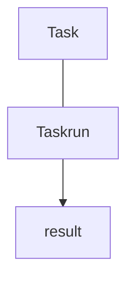
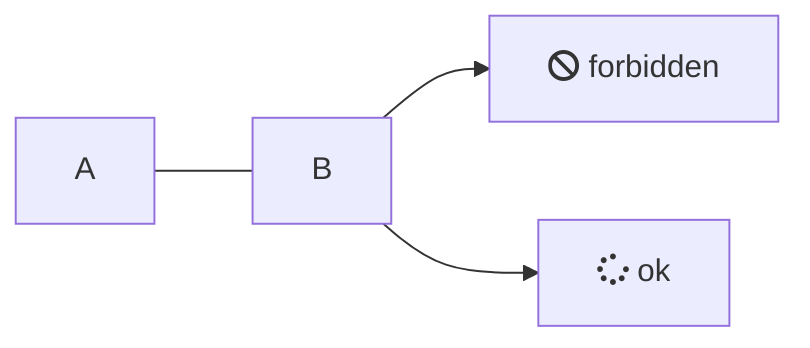

<script src="https://unpkg.com/mermaid@8.4.0/dist/mermaid.min.js"></script>

- minikube versoin
```
minikube version: v1.24.0
commit: 76b94fb3c4e8ac5062daf70d60cf03ddcc0a741b
```

- k cluster-info

```
Kubernetes control plane is running at https://127.0.0.1:50205
CoreDNS is running at https://127.0.0.1:50205/api/v1/namespaces/kube-system/services/kube-dns:dns/proxy

To further debug and diagnose cluster problems, use 'kubectl cluster-info dump'.
```

- 動かない

```
  k -n tekton-pipelines logs tekton-pipelines-controller-7b54589854-j8tbt
2023/03/12 17:35:16 Registering 9 clients
2023/03/12 17:35:16 Registering 6 informer factories
2023/03/12 17:35:16 Registering 10 informers
2023/03/12 17:35:16 Readiness and health check server listening on port 8080
2023/03/12 17:35:16 Registering 5 controllers
{"level":"info","ts":1678642516.820094,"logger":"fallback","caller":"cache/cacheclient.go:42","msg":"CACHE CLIENT &{lru:0x4000529ea0 lock:{w:{state:0 sema:0} writerSem:0 readerSem:0 readerCount:0 readerWait:0}}"}
{"severity":"info","timestamp":"2023-03-12T17:35:16.826Z","logger":"tekton-pipelines-controller","caller":"profiling/server.go:64","message":"Profiling enabled: false","commit":"d1b63d4"}
{"severity":"fatal","timestamp":"2023-03-12T17:35:16.827Z","logger":"tekton-pipelines-controller","caller":"sharedmain/main.go:335","message":"Version check failed","commit":"d1b63d4","error":"kubernetes version \"1.22.3\" is not compatible, need at least \"1.23.0-0\" (this can be overridden with the env var \"KUBERNETES_MIN_VERSION\")","stacktrace":"knative.dev/pkg/injection/sharedmain.CheckK8sClientMinimumVersionOrDie\n\tknative.dev/pkg@v0.0.0-20221123011842-b78020c16606/injection/sharedmain/main.go:335\nknative.dev/pkg/injection/sharedmain.MainWithConfig\n\tknative.dev/pkg@v0.0.0-20221123011842-b78020c16606/injection/sharedmain/main.go:237\nmain.main\n\tgithub.com/tektoncd/pipeline/cmd/controller/main.go:135\nruntime.main\n\truntime/proc.go:250"}
```





# Frequently Asked Questions

Documentation coming soon!



